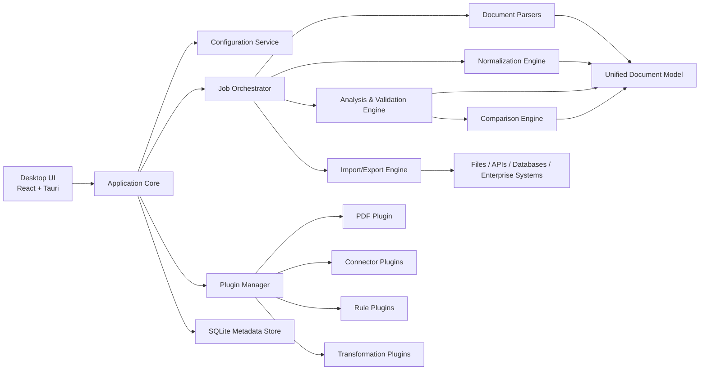

# Architecture Overview

## 1. Architectural Style

The recommended solution is a modular desktop application with a local processing engine and an extensibility layer for file formats, transformations, and connectors.

## 2. Proposed Stack

- Shell: Tauri
- Frontend: React + TypeScript
- Backend processing engine: Python
- Persistence: SQLite
- Job execution: asynchronous worker queue inside the local engine
- Packaging: OS-native installers

## 3. High-Level Design



## 4. Core Modules

### 4.1 Desktop UI

Responsibilities:

- File import workflow
- Sheet and table preview
- Findings dashboard
- Profile management
- Plugin management
- Job history and logs

### 4.2 Application Core

Responsibilities:

- Route user actions to services
- Coordinate long-running jobs
- Manage local state and settings
- Expose a stable interface between UI and processing engine

### 4.3 Document Parsers

Responsibilities:

- Read source files
- Detect workbook structure
- Extract sheet content and metadata
- Report parsing diagnostics

Recommended libraries:

- `openpyxl`
- `pandas`
- `pyxlsb`
- `xlrd` only if legacy support is required and compatible with policy

### 4.4 Unified Document Model

Suggested entities:

- `Document`
- `Sheet`
- `TableRegion`
- `RowRecord`
- `CellValue`
- `ValidationFinding`
- `MappingProfile`
- `ConnectorProfile`

### 4.5 Normalization Engine

Responsibilities:

- Convert raw extracted cells into semantic fields
- Apply mapping profiles
- Standardize units, dates, and enumerations
- Build normalized records for export and analysis
- Capture comparable snapshots for visual change review and audit logging

### 4.6 Analysis and Validation Engine

Responsibilities:

- Rule-based validation
- Cross-sheet consistency checks
- Duplicate and anomaly detection
- Severity scoring and issue aggregation

Possible expansion:

- statistical anomaly detection
- template classification
- AI-assisted field interpretation for semi-structured layouts

### 4.6.1 PDF and Excel Comparison Engine

Responsibilities:

- Normalize PDF parser output and Excel parser output into comparable records
- Match records by configured keys and field mappings
- Detect missing PDF records, missing Excel records, value mismatches, ambiguous matches, and low-confidence PDF extraction
- Preserve traceability to Excel sheet/cell addresses and PDF page/bounding-box coordinates
- Emit comparison findings through the same findings dashboard used by validation rules

See [PDF Parsing and Excel Comparison Plan](./pdf-excel-comparison-plan.md) for the phased implementation plan.

### 4.7 Import/Export Engine

Responsibilities:

- Serialize normalized output
- Execute connector flows
- Validate outbound schema
- Provide preview and dry-run capabilities

Adapter categories:

- file adapters
- API adapters
- database adapters
- enterprise connector adapters

### 4.8 Plugin Manager

Responsibilities:

- Discover installed plugins
- Verify compatibility and signatures
- Resolve permissions
- Register new parsers, rules, transforms, and connectors

## 5. Plugin Model

### 5.1 Plugin Types

- `parser`
- `connector`
- `rule-pack`
- `transform`
- `ui-extension`

### 5.2 Plugin Manifest Example

```json
{
  "id": "com.company.pdf-parser",
  "name": "PDF Parser Plugin",
  "version": "1.0.0",
  "apiVersion": "1.0",
  "capabilities": ["parser", "transform"],
  "permissions": ["read-files", "temp-storage"],
  "supportedFormats": [".pdf"],
  "entryPoint": "plugin.py",
  "signature": "signed-bundle-reference"
}
```

### 5.3 Plugin Lifecycle

1. Install plugin bundle
2. Verify manifest and signature
3. Check compatibility with core API
4. Register declared capabilities
5. Enable plugin for selected profiles
6. Log runtime activity and errors

## 6. Suggested Processing Flow

1. User selects source file
2. Parser extracts workbook structure
3. Normalization engine maps source into internal entities
4. Snapshot comparison highlights added, changed, and removed normalized values
5. Validation engine evaluates rules
6. User reviews changes and findings
7. Export engine writes data or calls external system
8. Audit log stores the run details and data changes

PDF-vs-Excel comparison flow:

1. User selects an Excel workbook and a PDF file
2. Excel parser extracts workbook tables and metadata
3. PDF parser plugin extracts page text, tables, confidence, and page coordinates
4. Normalization engine maps both sources into comparable records
5. Comparison engine matches records by configured keys
6. Findings dashboard shows missing records, mismatches, ambiguous matches, and low-confidence PDF extraction

## 7. Persistence Model

Use SQLite for:

- application settings
- saved profiles
- plugin registry
- run history
- audit events
- cached normalized previews

## 8. Security Notes

- Secrets for connectors should be stored in OS keychain where available
- Plugins should run with least privilege
- Production mode should permit signed plugins only
- Large imported files should be scanned for safe handling and bounded resource usage

## 9. Deployment Approach

- Package desktop client per OS
- Bundle the Python runtime with the application
- Maintain a plugin directory under application data
- Deliver plugin SDK and sample plugins separately
