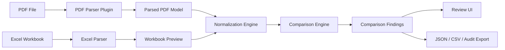

# PDF Parsing and Excel Comparison Plan

## 1. Objective

Add an optional PDF ingestion pipeline that extracts structured data from `.pdf` documents and compares it against normalized Excel workbook data. The goal is to detect missing records, mismatched field values, formatting-driven exceptions, and trace every finding back to its PDF page/region and Excel sheet/cell.

## 2. Target Scenarios

- Compare an engineering PDF register against an Excel workbook register.
- Verify that PDF tables match Excel tables after handover or export.
- Detect values present in PDF but absent from Excel.
- Detect values present in Excel but absent from PDF.
- Identify mismatched status, quantity, revision, asset id, serial number, or description fields.
- Flag uncertain OCR/table extraction results for manual review.

## 3. Architecture Extension



## 4. PDF Parser Responsibilities

The PDF parser plugin should return a stable intermediate model rather than directly comparing values.

Required extraction:

- document metadata: file name, size, hash, page count, parse timestamp
- page-level text blocks with page number and bounding boxes
- detected tables with rows, columns, cell text, confidence, and bounding boxes
- extraction warnings such as low confidence, empty pages, rotated pages, encrypted PDFs, or missing text layer

Optional extraction:

- OCR text for scanned PDFs
- images and stamps
- table headers inferred from layout
- color cues for highlighted cells or status markers
- page section titles and revision blocks

## 5. Proposed Shared PDF Contracts

Initial TypeScript/Python contract shape:

```ts
export interface PdfDocumentPreview {
  documentId: string;
  sourceName: string;
  sourcePath: string;
  pageCount: number;
  importedAt: string;
  pages: PdfPagePreview[];
  warnings: string[];
}

export interface PdfPagePreview {
  pageNumber: number;
  width: number;
  height: number;
  textBlocks: PdfTextBlock[];
  tables: PdfTablePreview[];
}

export interface PdfTextBlock {
  id: string;
  text: string;
  bbox: [number, number, number, number];
  confidence?: number | null;
}

export interface PdfTablePreview {
  id: string;
  pageNumber: number;
  bbox: [number, number, number, number];
  rowCount: number;
  columnCount: number;
  confidence?: number | null;
  rows: PdfCellPreview[][];
}

export interface PdfCellPreview {
  text: string;
  bbox: [number, number, number, number];
  confidence?: number | null;
  fillColor?: string | null;
  fontColor?: string | null;
}
```

## 6. Comparison Model

Normalize both PDF and Excel into comparable records before matching.

Recommended normalized comparison record:

```ts
export interface ComparisonRecord {
  source: "excel" | "pdf";
  tableId: string;
  recordId?: string | null;
  keyValues: Record<string, string>;
  values: Record<string, string | number | boolean | null>;
  trace: ComparisonTrace[];
  confidence?: number | null;
}

export interface ComparisonTrace {
  source: "excel" | "pdf";
  address?: string | null;
  sheetName?: string | null;
  pageNumber?: number | null;
  bbox?: [number, number, number, number] | null;
}
```

## 7. Matching Strategy

Use a staged matching approach:

1. Exact key match by configured fields such as `id`, `asset_id`, `serial_number`, `reference`, or `revision`.
2. Normalized key match with case folding, whitespace cleanup, punctuation cleanup, and locale normalization.
3. Composite key match using multiple fields, for example `asset_id + revision`.
4. Fuzzy fallback for descriptions only when confidence thresholds are configured.
5. Manual-review finding when no confident match can be established.

Default matching should be conservative. Fuzzy matching must not silently overwrite exact mismatch findings.

## 8. Comparison Finding Types

Core finding codes:

- `comparison.pdf_missing_record`: Excel record has no matching PDF record.
- `comparison.excel_missing_record`: PDF record has no matching Excel record.
- `comparison.value_mismatch`: matched record has different field values.
- `comparison.low_confidence_pdf`: PDF extraction confidence is below threshold.
- `comparison.ambiguous_match`: multiple possible matches found.
- `comparison.unmapped_pdf_column`: PDF table column is not mapped to Excel field.
- `comparison.unmapped_excel_field`: Excel field is not mapped to PDF column.
- `comparison.format_signal`: color, grouping, stamp, or highlight indicates special handling.

Severity guidance:

- `critical`: safety/compliance-critical field mismatch
- `error`: required record or required field mismatch
- `warning`: ambiguous match, low confidence, optional field mismatch
- `info`: formatting signal or extracted metadata notice

## 9. API Plan

Recommended backend endpoints:

```text
POST /pdf/preview
POST /pdf/normalize
POST /documents/compare/pdf-excel
```

Initial compare request:

```json
{
  "excelDocumentPath": "/absolute/path/source.xlsx",
  "pdfDocumentPath": "/absolute/path/source.pdf",
  "excelSheetNames": ["Register"],
  "keyFields": ["id"],
  "fieldMappings": [
    { "excelField": "id", "pdfField": "asset_id" },
    { "excelField": "status", "pdfField": "status" }
  ],
  "pdfTableIds": [],
  "excelTableIds": [],
  "allowFuzzyDescriptions": false,
  "minimumPdfConfidence": 0.85,
  "includeFormattingSignals": true
}
```

Initial compare response:

```json
{
  "comparisonId": "run-id",
  "excelDocumentId": "excel-id",
  "pdfDocumentId": "pdf-id",
  "matchedRecordCount": 120,
  "findingCount": 7,
  "findings": [],
  "warnings": []
}
```

## 10. UI Plan

Add a new `Compare` workflow:

- PDF file picker next to workbook picker
- PDF preview tab with pages, extracted tables, confidence, and warnings
- comparison profile panel with key fields and field mappings
- `Compare PDF vs Excel` operation button
- comparison summary cards: matched, PDF missing, Excel missing, mismatches, low-confidence
- side-by-side detail view:
  - left: Excel row with sheet/cell trace
  - right: PDF row with page/bounding-box trace
  - center: finding severity and field-level diff
- export comparison report as JSON/CSV

## 11. Parser Library Options

Recommended staged approach:

- Text-based PDFs: `pypdf`, `pdfplumber`, or `PyMuPDF`.
- Table extraction: `pdfplumber` first, optionally Camelot/Tabula for lattice tables.
- OCR fallback: Tesseract through optional plugin dependency, not bundled in MVP by default.
- Scanned PDF detection: pages with low/no text layer should produce `low_confidence_pdf` or `ocr_required` warnings.

## 12. Implementation Phases

### Phase A. Contract and Plugin Skeleton

Deliverables:

- shared PDF preview contracts
- backend PDF preview endpoint
- sample PDF plugin registration extended with parser capability metadata
- UI displays installed PDF parser plugin capability

Acceptance:

- `/plugins` shows PDF parser support
- `/pdf/preview` returns page count and warnings for sample PDFs

### Phase B. Text-Based PDF Table Extraction

Deliverables:

- parse text-based PDF tables
- capture page, table, row, cell, bounding box, confidence
- PDF preview UI tab

Acceptance:

- sample text PDF table appears in UI
- extracted cells include page trace

### Phase C. Normalization and Mapping

Deliverables:

- PDF normalized records
- profile-driven PDF field mappings
- shared normalization utilities for whitespace, case, dates, and numbers

Acceptance:

- same logical record can be represented from PDF and Excel using a common record shape

### Phase D. PDF vs Excel Comparison Engine

Deliverables:

- exact key matching
- composite key matching
- value mismatch detection
- missing-record detection
- comparison findings model

Acceptance:

- controlled sample with known mismatches reports expected findings

### Phase E. Review UI and Reporting

Deliverables:

- side-by-side comparison view
- confidence and trace display
- report export

Acceptance:

- user can inspect each mismatch with Excel cell and PDF page location

### Phase F. OCR and Advanced Tables

Deliverables:

- optional OCR plugin dependency
- scanned PDF warnings
- confidence thresholds
- table extraction strategy selection

Acceptance:

- scanned PDF is either parsed with confidence or clearly marked for manual/OCR review

## 13. Risks and Mitigations

- PDF tables are visually structured, not semantically structured.
  Mitigation: preserve confidence and bounding boxes, require manual review for ambiguous extraction.
- Scanned PDFs require OCR and language packs.
  Mitigation: make OCR optional and plugin-scoped.
- Field names differ between PDF and Excel.
  Mitigation: use comparison profiles with field mappings and aliases.
- PDF may contain repeated headers/footers.
  Mitigation: page region filtering and repeated-text suppression.
- Color/stamp meaning can be domain-specific.
  Mitigation: treat formatting as signals, not automatic errors, unless profile rules define severity.

## 14. Test Dataset Plan

Create fixtures:

- text-based PDF with one clean table
- PDF with repeated headers
- PDF with merged/stacked visual cells
- PDF with colored status highlights
- scanned PDF sample marked as OCR-required
- paired Excel file with matching data
- paired Excel file with deliberate missing records and value mismatches

Regression checks:

- PDF page count and table count
- extracted key fields
- exact match count
- expected mismatch findings
- low-confidence handling
- report export shape
